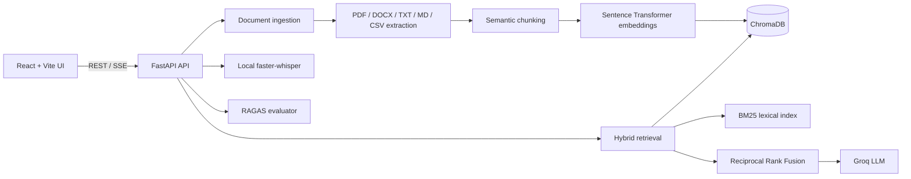

# Enterprise RAG Chatbot

> A production-shaped knowledge assistant that turns your documents into a searchable, cited, voice-enabled workspace.


**Enterprise RAG Chatbot** combines semantic search, BM25 lexical search, Reciprocal Rank Fusion, Groq generation, local Whisper transcription, and RAGAS evaluation in one full-stack application.

It is designed for teams that need answers grounded in their own PDFs, DOCX files, Markdown, text, or CSV data instead of answers based only on a model's general memory.

## Screenshots
Evaluation dashboard 


## Highlights

- **Grounded answers**: the LLM receives retrieved document context, not an empty prompt.
- **True hybrid retrieval**: ChromaDB vector ranking plus BM25 lexical ranking merged with Reciprocal Rank Fusion.
- **Semantic chunking**: adjacent sentences are grouped by embedding similarity so topic boundaries remain coherent.
- **Citations and evidence**: answers expose source filename, page, score, citation, and excerpt.
- **Streaming responses**: sources arrive first, then answer tokens stream over Server-Sent Events.
- **Local voice transcription**: `faster-whisper` runs locally for free; browser SpeechRecognition is the fallback.
- **Async ingestion**: larger uploads run as background jobs with progress tracking.
- **RAGAS evaluation**: faithfulness, answer relevancy, context precision, and context recall.
- **Operational visibility**: health checks, cache metrics, latency metrics, evaluation history, and startup scripts.

## Architecture



## Request Lifecycle

### Document ingestion

```text
Upload file -> validate -> extract text -> semantic chunks -> embeddings -> ChromaDB
```

PDF pages preserve page numbers. DOCX paragraphs and tables are extracted. Text files support common encodings. Scanned PDFs can use optional OCR.

### Question answering

```text
Question
  -> embedding search in ChromaDB
  -> BM25 lexical search
  -> Reciprocal Rank Fusion
  -> similarity filtering
  -> diversity reranking
  -> grounded Groq prompt
  -> SSE answer stream with citations
```

### Voice input

```text
MediaRecorder -> local faster-whisper -> transcript in composer
                              \-> browser SpeechRecognition fallback
```

## Technology Stack

| Layer | Technology | Purpose |
| --- | --- | --- |
| UI | React, Vite, Redux Toolkit | Workspace and application state |
| API | FastAPI, Uvicorn, Pydantic | Typed HTTP and SSE endpoints |
| Semantic search | Sentence Transformers | Query and document embeddings |
| Lexical search | rank-bm25 | Exact-term retrieval |
| Vector store | ChromaDB | Persistent local vector storage |
| Generation | Groq LLM | Grounded answer generation |
| Voice | faster-whisper | Free local speech-to-text |
| Evaluation | RAGAS | Retrieval and answer quality metrics |
| Processing | PyPDF, python-docx | Document extraction |


