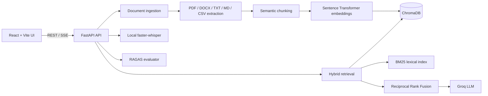

# Enterprise RAG Chatbot

> A production-shaped knowledge assistant that turns your documents into a searchable, cited, voice-enabled workspace.


**Enterprise RAG Chatbot** combines semantic search, BM25 lexical search, Reciprocal Rank Fusion, Groq generation, local Whisper transcription, and RAGAS evaluation in one full-stack application.

It is designed for teams that need answers grounded in their own PDFs, DOCX files, Markdown, text, or CSV data instead of answers based only on a model's general memory.

## Screenshots

Add project screenshots to `screenshots/` using these names:

| Chat workspace | Document library |
| --- | --- |
|  |  |

| Evaluation dashboard | Voice input and sources |
| --- | --- |
|  |  |

## Highlights

- **Grounded answers**: the LLM receives retrieved document context, not an empty prompt.
- **True hybrid retrieval**: ChromaDB vector ranking plus BM25 lexical ranking merged with Reciprocal Rank Fusion.
- **Semantic chunking**: adjacent sentences are grouped by embedding similarity so topic boundaries remain coherent.
- **Citations and evidence**: answers expose source filename, page, score, citation, and excerpt.
- **Streaming responses**: sources arrive first, then answer tokens stream over Server-Sent Events.
- **Local voice transcription**: `faster-whisper` runs locally for free; browser SpeechRecognition is the fallback.
- **Async ingestion**: larger uploads run as background jobs with progress tracking.
- **RAGAS evaluation**: faithfulness, answer relevancy, context precision, and context recall.
- **Operational visibility**: health checks, cache metrics, latency metrics, evaluation history, and startup scripts.

## Architecture



## Request Lifecycle

### Document ingestion

```text
Upload file -> validate -> extract text -> semantic chunks -> embeddings -> ChromaDB
```

PDF pages preserve page numbers. DOCX paragraphs and tables are extracted. Text files support common encodings. Scanned PDFs can use optional OCR.

### Question answering

```text
Question
  -> embedding search in ChromaDB
  -> BM25 lexical search
  -> Reciprocal Rank Fusion
  -> similarity filtering
  -> diversity reranking
  -> grounded Groq prompt
  -> SSE answer stream with citations
```

### Voice input

```text
MediaRecorder -> local faster-whisper -> transcript in composer
                              \-> browser SpeechRecognition fallback
```

## Technology Stack

| Layer | Technology | Purpose |
| --- | --- | --- |
| UI | React, Vite, Redux Toolkit | Workspace and application state |
| API | FastAPI, Uvicorn, Pydantic | Typed HTTP and SSE endpoints |
| Semantic search | Sentence Transformers | Query and document embeddings |
| Lexical search | rank-bm25 | Exact-term retrieval |
| Vector store | ChromaDB | Persistent local vector storage |
| Generation | Groq LLM | Grounded answer generation |
| Voice | faster-whisper | Free local speech-to-text |
| Evaluation | RAGAS | Retrieval and answer quality metrics |
| Processing | PyPDF, python-docx | Document extraction |

## Project Layout

```text
enterprise-rag-chatbot/
├── backend/
│   ├── app/
│   │   ├── api/routes/       # chat, documents, evaluation, health, transcription
│   │   ├── core/             # settings and logging
│   │   ├── models/           # Pydantic API contracts
│   │   └── services/         # ingestion, retrieval, embeddings, LLM, cache, jobs
│   ├── eval/                 # evaluation dataset and history
│   ├── requirements.txt
│   └── .env.example
├── frontend/
│   ├── src/components/       # chat, sources, documents, evaluation, sidebar
│   ├── src/store/            # Redux slices
│   ├── src/api/              # REST and SSE clients
│   └── package.json
├── screenshots/              # add GitHub README screenshots here
├── start.ps1
├── stop.ps1
└── docker-compose.yml
```

## Quick Start: Windows

### Prerequisites

- Python 3.11+
- Node.js 20+
- A Groq API key for answer generation and RAGAS judging
- Windows microphone permission for voice input

### Install backend

```powershell
cd backend
python -m venv venv
.\venv\Scripts\python.exe -m pip install -r requirements.txt
Copy-Item .env.example .env
```

Edit `backend/.env` and set:

```env
GROQ_API_KEY=your_key_here
```

### Install frontend

```powershell
cd frontend
npm install
```

### Start everything

From the repository root:

```powershell
powershell -ExecutionPolicy Bypass -File .\start.ps1
```

Open:

- Frontend: `http://localhost:5173`
- Backend: `http://localhost:8000`
- Health: `http://localhost:8000/health`

If port `8000` is unavailable, the launcher automatically uses `8001` and configures the Vite proxy to match.

### Stop everything

```powershell
powershell -ExecutionPolicy Bypass -File .\stop.ps1
```

Preview without stopping processes:

```powershell
powershell -ExecutionPolicy Bypass -File .\stop.ps1 -WhatIf
```

## Configuration

Important settings in `backend/.env`:

```env
GROQ_MODEL=llama-3.3-70b-versatile
EMBEDDING_MODEL=sentence-transformers/all-MiniLM-L6-v2
VOICE_MODEL_SIZE=base
VOICE_DEVICE=cpu
CHUNK_SIZE=800
CHUNK_OVERLAP=120
SEMANTIC_CHUNKING=true
SEMANTIC_SIMILARITY_THRESHOLD=0.55
HYBRID_VECTOR_WEIGHT=0.7
RRF_K=60
TOP_K=6
SIMILARITY_THRESHOLD=0.25
DIVERSITY_THRESHOLD=0.85
```

The first use of the embedding and faster-whisper models may download model files locally.

### Optional OCR

Set `OCR_ENABLED=true` and install `pdf2image`, `pytesseract`, plus the Tesseract system application to process scanned PDFs.

## API Reference

| Method | Endpoint | Description |
| --- | --- | --- |
| GET | `/health` | Full service status and metrics |
| GET | `/health/live` | Lightweight liveness check |
| GET | `/health/ready` | Dependency readiness check |
| POST | `/api/chat` | Non-streaming grounded answer |
| POST | `/api/chat/stream` | SSE sources and token stream |
| POST | `/api/documents/upload` | Synchronous document ingestion |
| POST | `/api/documents/upload/async` | Background document ingestion |
| GET | `/api/documents/jobs/{job_id}` | Ingestion progress |
| GET | `/api/documents` | Indexed source list |
| DELETE | `/api/documents/{source_name}` | Delete a source |
| POST | `/api/transcribe` | Local Whisper transcription |
| POST | `/api/evaluate` | Run RAGAS evaluation |
| GET | `/api/evaluate/history` | Recent evaluation runs |

## Evaluation

Edit `backend/eval/test_dataset.json` with real questions and expected answers from your documents. Then use the Evaluation tab or:

```powershell
cd backend
.\venv\Scripts\python.exe eval\run_evaluation.py
```

The dashboard reports faithfulness, answer relevancy, context precision, context recall, per-question results, and recent run history.

## Testing and Validation

```powershell
cd backend
.\venv\Scripts\python.exe -m compileall app tests
.\venv\Scripts\python.exe -m unittest tests.test_chunking tests.test_cache tests.test_api_contracts -v

cd ..\frontend
npm run build
```

## Security Notes

- Never commit `.env` or API keys.
- Rotate any API key that has been shared publicly.
- Local evaluation history, Chroma data, logs, virtual environments, and build output are intentionally ignored.
- Add authentication and tenant isolation before deploying for multiple organizations.

## Roadmap

- Authentication and role-based access
- Tenant-isolated Chroma collections
- Redis-backed job and cache storage
- Cross-encoder reranking
- OCR packaging for production deployments
- OpenTelemetry and Prometheus dashboards
- Document preview with highlighted citations

## License

Add the license that matches your intended distribution before publishing this repository.
